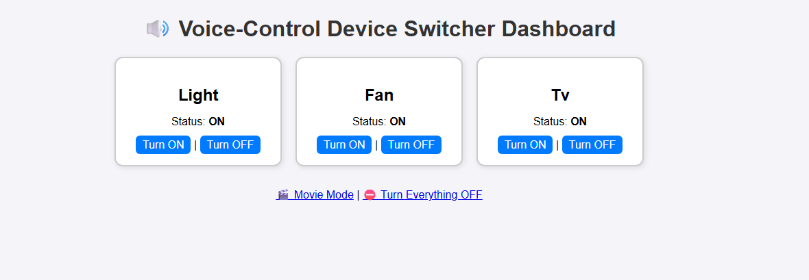

# 🎤 Voice-Control Device Switcher

A simple project that lets you control virtual devices (Light, Fan, TV) using **voice commands** and a **Flask web dashboard**.

## 🚀 Features
- Voice control with `speech_recognition` + `pyttsx3`
- Web dashboard with Flask
- Shared device state between voice and web
- Auto-updating UI
- Modes: Movie Mode, Turn Everything Off

## ▶️ Usage

Run voice + Flask together:

python main.py

Open the dashboard in your browser:

http://127.0.0.1:5000

## 🎤 Example Voice/Text Commands

- Turn on light
- Turn off fan
- Movie mode
- Turn everything off
- Status

## 📸 Screenshot



## 🛠️ Installation
```bash
git clone https://github.com/Alaricseq/voice_device_switcher.git
cd voice_device_switcher
python -m venv venv
source venv/bin/activate   # (or venv\Scripts\activate on Windows)
pip install -r requirements.txt


